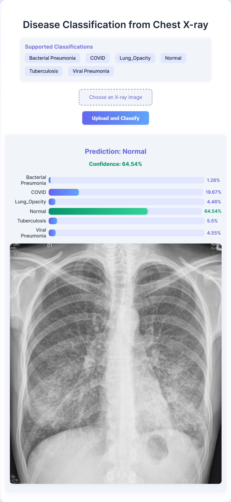

# Disease Classification from Chest X-ray

A modern web application for classifying chest X-ray images into six disease categories using a deep learning model (ResNet-50). The app provides a user-friendly interface for uploading X-ray images and visualizes model confidence for each class.

## Features

- **Deep Learning Model:** Classifies X-rays into:
  - Bacterial Pneumonia
  - COVID
  - Lung Opacity
  - Normal
  - Tuberculosis
  - Viral Pneumonia
- **Modern UI:** Responsive, visually appealing interface.
- **Confidence Visualization:** Horizontal bar chart shows model confidence for all classes.
- **Image Preview:** See the uploaded X-ray alongside results.
- **Easy to Use:** Upload, classify, and view results in seconds.

## Demo



## Getting Started

### Prerequisites

- Python 3.7+
- pip

### Installation

1. **Clone the repository:**
   ```bash
   git clone <https://github.com/EtimbukUdofia/X-ray-Disease-Classification>
   cd disease_classification
   ```
2. **Create a virtual environment (optional but recommended):**
   ```bash
   python -m venv venv
   source venv/bin/activate  # On Windows: venv\Scripts\activate
   ```
3. **Install dependencies:**
   ```bash
   pip install -r requirements.txt
   ```
4. **Download the model weights:**
   - Place your trained PyTorch model as `model/xray_model.pth` (already present if you have the provided files).

### Running the App

```bash
python app.py
```

- The app will be available at [http://localhost:5000](http://localhost:5000)

## Usage

1. Open the web app in your browser.
2. Review the supported classifications.
3. Upload a chest X-ray image (JPG, PNG, etc.).
4. View the predicted class, confidence, and a confidence bar chart for all classes.

## Project Structure

```
├── app.py                # Flask app and prediction logic
├── model.py              # Model architecture (ResNet-50)
├── model/
│   └── xray_model.pth    # Trained model weights
├── requirements.txt      # Python dependencies
├── static/
│   └── uploads/          # Uploaded images
├── templates/
│   └── index.html        # Main HTML template
└── README.md             # Project documentation
```

## Tech Stack

- Python, Flask
- PyTorch, Torchvision
- Pillow (image processing)
- HTML5, CSS3, JavaScript (vanilla)

## Notes

- The model expects RGB images resized to 224x224 pixels.
- For best results, use high-quality chest X-ray images.
- You can retrain or fine-tune the model using your own dataset and update `model/xray_model.pth`.

## License

This project is for educational and research purposes. Please check dataset and model licenses if you plan to use it commercially.
